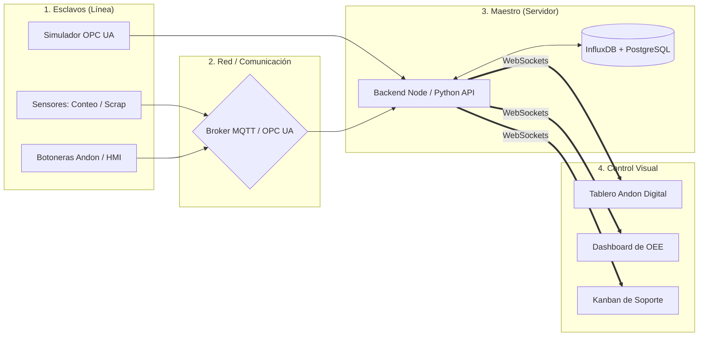

<!-- ========================================== -->
<!-- SLIDE 1: PORTADA CON MARCO CIRCULAR PARA FOTO -->
<!-- ========================================== -->

  

    

      
      ARQUITECTURA MASTER-SLAVE • IOT
    

    <h1 class="text-4xl font-extrabold text-white leading-tight mb-2">
      NeuronaMedia
    </h1>
    <h2 class="text-lg font-medium text-slate-300 mb-6">
      Sistema de Control Visual y Monitoreo de Producción en Tiempo Real
    </h2>
    

      ⚙️ Sensores IoT
      ⚡ Protocolo MQTT
      📊 Andon Digital
    

    

      Presentado por: <strong class="text-slate-200">Equipo de Desarrollo NeuronaMedia</strong>
    

  

  

    

      <svg class="absolute w-48 h-48 text-slate-600/40 animate-gear-spin pointer-events-none" viewBox="0 0 100 100">
        <circle cx="50" cy="50" r="46" fill="none" stroke="currentColor" stroke-width="1.5" stroke-dasharray="4 3"></circle>
        <circle cx="50" cy="50" r="49" fill="none" stroke="currentColor" stroke-width="0.8" stroke-dasharray="1 8"></circle>
      </svg>
      

        

          
        

        

          
        

      

    

    

      
Ponente / Equipo

      
Líder de Proyecto

    

  

  <CircuitGearsAnimation height="55px" />

---
transition: fade-out
---

# El Problema: Ceguera Operativa en Planta

Las líneas de producción sufren demoras críticas por falta de información instantánea:

  

    

      01
      <h3 class="text-sm font-bold text-white">Paros No Detectados a Tiempo</h3>
    

    

      Fallas mecánicas o atascos pasan inadvertidos por minutos hasta que el operador busca físicamente al personal de mantenimiento.
    

  

  

    

      02
      <h3 class="text-sm font-bold text-white">Scrap Silencioso</h3>
    

    

      Piezas defectuosas se acumulan sin registro oportuno. Las mermas se descubren al final del turno, impidiendo correcciones inmediatas.
    

  

  

    

      03
      <h3 class="text-sm font-bold text-white">Bitácoras Manuales y Papel</h3>
    

    

      Datos capturados a mano propensos a errores, información desfasada y nula trazabilidad histórica de causa raíz.
    

  

  

    

      04
      <h3 class="text-sm font-bold text-white">Respuesta Descoordinada</h3>
    

    

      Sin un canal visual centralizado, mantenimiento y control de calidad no tienen orden de prioridad ni métricas de tiempo de atención.
    

  

  Consecuencia:
  Baja disponibilidad de maquinaria • Costos por merma • Incumplimiento de metas OEE

  <CircuitGearsAnimation height="50px" />

---

# La Solución: Ecosistema 360° en Tiempo Real

Integración continua de extremo a extremo: del sensor en máquina a la pantalla del supervisor.

  

    

      
01

      <h3 class="text-sm font-bold text-white mb-2">Captura en Piso (Esclavos)</h3>
      

        Hardware en cada estación: sensores de conteo, detección de paro y botoneras Andon manuales para reporte ágil.
      

    

    

      ESP32 • Sensores I/O • HMI
    

  

  

    

      
02

      <h3 class="text-sm font-bold text-white mb-2">Canalización Inmediata</h3>
      

        Protocolos industriales ultraligeros de suscripción/publicación que transfieren telemetría con latencia inferior a 100 ms.
      

    

    

      Broker MQTT • WebSockets
    

  

  

    

      
03

      <h3 class="text-sm font-bold text-white mb-2">Control Visual Activo</h3>
      

        Tableros Andon digitales proyectados en planta, dashboards de OEE y panel Kanban para resolución cronometrada de tickets.
      

    

    

      Andon Digital • Kanban • OEE
    

  

  <CircuitGearsAnimation height="50px" />

---

# Arquitectura General: Master-Slave

Diseño desacoplado y resiliente para la continuidad operativa de la planta:

  

    <strong class="text-cyan-400">Resiliencia Local:</strong> Cada esclavo sigue operando de forma autónoma aunque exista una interrupción temporal en la red.
  

  

    <strong class="text-emerald-400">Actualización en Vivo:</strong> WebSockets distribuyen el estado de las máquinas a todas las pantallas de planta simultáneamente.
  

  <CircuitGearsAnimation height="45px" />

---

# Capa de Adquisición: Esclavos y Contingencia

  

    

      
      <h3 class="text-xs font-bold text-white tracking-wide uppercase font-mono">Telemetría Automática</h3>
    

    <ul class="text-xs text-slate-300 space-y-3">
      <li class="flex items-start gap-2">
        ✔
        <strong>Sensores de Conteo:</strong> Sensores fotoeléctricos o inductivos registrando piezas producidas en tiempo real.
      </li>
      <li class="flex items-start gap-2">
        ✔
        <strong>Monitoreo de Estado:</strong> Detección de paros mediante lectura de señales eléctricas de maquinaria.
      </li>
      <li class="flex items-start gap-2">
        ✔
        <strong>Básculas de Scrap:</strong> Sensores de pesaje dedicados en contenedores de rechazo para cuantificar merma.
      </li>
    </ul>
  

  

    

      
      <h3 class="text-xs font-bold text-white tracking-wide uppercase font-mono">Reporte Ágil & Contingencia</h3>
    

    <ul class="text-xs text-slate-300 space-y-3">
      <li class="flex items-start gap-2">
        ●
        <strong>Botonera Andon Física:</strong> 3 botones de acceso directo: Falla, Calidad, Materiales.
      </li>
      <li class="flex items-start gap-2">
        ●
        <strong>HMI Simplificada:</strong> Pantallas táctiles de dos toques para operadores en estaciones críticas.
      </li>
      <li class="flex items-start gap-2">
        ●
        <strong>Escaneo QR Móvil (Respaldo):</strong> Contingencia manual inmediata desde celular en caso de daño en sensores físicos.
      </li>
    </ul>
  

  <CircuitGearsAnimation height="50px" />

---

# Plataforma Web: Control Visual Integral

Tres interfaces diseñadas para cada nivel operativo de la empresa:

  

    
PISO DE PLANTA

    <h3 class="text-sm font-bold text-white mb-2">Tablero Andon Digital</h3>
    

      Proyectado en Smart TVs sobre las líneas con codificación universal de colores:
    

    

      

        VERDEProducción Normal
      

      

        AMARILLOAlerta / Calidad
      

      

        ROJOParo de Línea
      

    

  

  

    
SUPERVISIÓN

    <h3 class="text-sm font-bold text-white mb-2">Dashboard de OEE</h3>
    

      Métricas consolidadas para líderes de turno y control de operaciones:
    

    <ul class="text-[11px] text-slate-300 space-y-1.5">
      <li>• <strong>OEE Calculado en Vivo</strong> (Disponibilidad / Calidad).</li>
      <li>• <strong>Piezas Meta vs. Real</strong> con indicador de avance.</li>
      <li>• <strong>Tasa de Scrap</strong> en tiempo real por lote.</li>
      <li>• <strong>Historial de Tiempos Muertos</strong> auditables.</li>
    </ul>
  

  

    
MANTENIMIENTO

    <h3 class="text-sm font-bold text-white mb-2">Kanban de Soporte</h3>
    

      Gestión rápida de incidencias para reducir los tiempos medios de reparación:
    

    <ul class="text-[11px] text-slate-300 space-y-1.5">
      <li>• <strong>Alertas Nuevas:</strong> Disparadas por sensor o botón.</li>
      <li>• <strong>En Atención:</strong> Técnico asignado con temporizador.</li>
      <li>• <strong>Resueltas:</strong> Registro de solución y refacciones.</li>
    </ul>
  

  <CircuitGearsAnimation height="50px" />

---

# Stack Tecnológico y Comunicaciones

  

    
COMUNICACIÓN INDUSTRIAL

    <h3 class="text-sm font-bold text-white mb-2">MQTT + OPC UA + WebSockets</h3>
    

      • <strong>MQTT (Eclipse Mosquitto):</strong> Transmisión pub/sub de bajo consumo de ancho de banda. 
      • <strong>OPC UA:</strong> Enlace nativo con PLCs industriales y simulación MVP en MATLAB. 
      • <strong>WebSockets:</strong> Difusión inmediata hacia los navegadores web.
    

  

  

    
ALMACENAMIENTO DE DATOS

    <h3 class="text-sm font-bold text-white mb-2">InfluxDB + PostgreSQL</h3>
    

      • <strong>InfluxDB (Time-Series):</strong> Almacena millones de lecturas de sensores por segundo con compresión avanzada. 
      • <strong>PostgreSQL (Relacional):</strong> Gestión de usuarios, turnos, catálogo de fallas y trazabilidad.
    

  

  

    
PROCESAMIENTO CENTRAL

    <h3 class="text-sm font-bold text-white mb-2">Servidor Maestro (API)</h3>
    

      Motor de cálculo en Node.js / Python para métricas en vivo (OEE, MTTR, scrap) y distribución de eventos a los clientes web.
    

  

  

    
FRONTEND & PRESENTACIÓN

    <h3 class="text-sm font-bold text-white mb-2">Vue 3 + Slidev + UnoCSS</h3>
    

      Interfaces reactivas fluidas, paneles modulares y presentación técnica con tipografía minimalista y soporte de animaciones.
    

  

  <CircuitGearsAnimation height="50px" />

---

# Flujo Operativo: De la Falla a la Solución

Secuencia cronometrada de respuesta ante una contingencia en planta:

  

    0.0 seg
    

      <strong class="text-white">Detección de Incidencia:</strong> Sensor detecta paro o el operador presiona la Botonera Andon.
    

  

  

    0.2 seg
    

      <strong class="text-white">Publicación MQTT:</strong> El esclavo envía el payload JSON al broker local maestro (<code class="text-cyan-300">planta/linea-1/alerta</code>).
    

  

  

    0.5 seg
    

      <strong class="text-white">Alerta en Pantalla Andon:</strong> El backend emite vía WebSockets. La TV de la nave parpadea en rojo y se crea ticket en Kanban.
    

  

  

    1.5 seg
    

      <strong class="text-white">Asignación de Técnico:</strong> Mantenimiento toma el ticket desde su dispositivo; el estado cambia a "En Atención".
    

  

  

    Cierre
    

      <strong class="text-white">Reanudación y Auditoría:</strong> Línea reanuda en Verde y el tiempo de paro queda registrado para el OEE.
    

  

  <CircuitGearsAnimation height="50px" />

---

# Impacto y Resultados de Negocio (ROI)

Mejoras cuantificables proyectadas en piso de producción:

  

    
-40%

    
Tiempo de Respuesta

    
Reducción del MTTR al eliminar demoras en aviso de mantenimiento

  

  

    
+15%

    
Incremento en OEE

    
Mayor disponibilidad de máquinas al resolver micro-paros

  

  

    
-25%

    
Reducción de Scrap

    
Detección temprana de piezas defectuosas antes de lotes mayores

  

  

    
100%

    
Trazabilidad Digital

    
Auditoría continua de turnos sin depender de bitácoras manuales

  

  

    
Retorno de Inversión (ROI) Estimado

    
Implementación modular progresiva sin frenar la línea de manufactura activa.

  

  

    Amortización &lt; 3 meses
  

  <CircuitGearsAnimation height="50px" />

---
layout: end
class: text-center
---

  

    NEURONAMEDIA • INDUSTRIA 4.0
  

  <h1 class="text-4xl font-extrabold text-white mb-3">
    Control Visual. Respuesta Rápida. Cero Paros Ciegos.
  </h1>

  

    Conectando la telemetría en piso con la toma de decisiones inmediata.
  

  

    
ESTADO DEL MVP:

    

      
✔ Arquitectura Master-Slave funcional

      
✔ Integración MQTT, OPC UA y WebSockets

      
✔ Tableros Andon y telemetría en tiempo real

    

    

      ¿Preguntas o comentarios?
    

  

  <CircuitGearsAnimation height="55px" />

