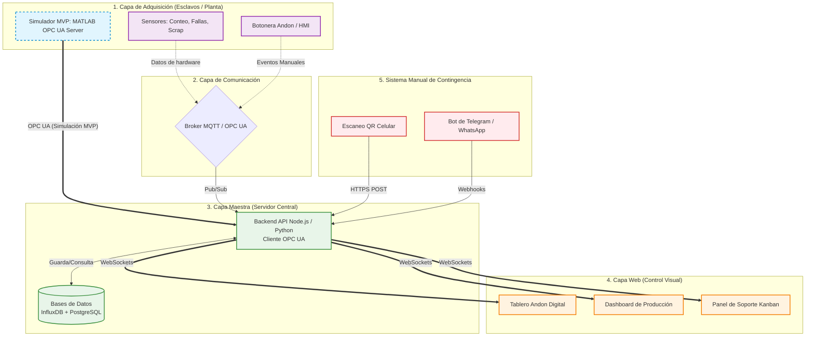

# Solución Integral: Sistema de Control Visual y Monitoreo de Producción (Arquitectura Master-Slave)

Este documento detalla la propuesta de solución para abordar los problemas de falta de visibilidad en tiempo real en las líneas de producción, tanto para incidencias (fallas mecánicas, calidad, materiales) como para los avances de producción y *scrap*.

## 1. Arquitectura General (Master-Slave)

La solución se basa en una arquitectura IoT (Internet de las Cosas) de tipo **Maestro-Esclavo (Master-Slave)**, combinada con una plataforma web centralizada para el control visual en tiempo real.

### Capa de Esclavos (Slaves / Nodos de Adquisición)
Los "esclavos" son dispositivos de hardware (ej. microcontroladores como ESP32, Raspberry Pi Pico o PLCs) instalados directamente en las líneas de producción. Su función es recolectar datos y enviarlos al maestro.

*   **Lectura de Sensores (Automático):**
    *   **Sensores de Conteo:** Sensores fotoeléctricos o inductivos para medir el avance de producción en tiempo real.
    *   **Sensores de Estado:** Monitoreo de señales eléctricas de las máquinas para detectar paros o fallas automáticas.
    *   **Sensores de Scrap:** Básculas o contadores dedicados a los contenedores de rechazo.
*   **Interfaz de Reporte Manual (Ágil):**
    *   **Botoneras (Andon físico):** Botones físicos (ej. Rojo=Falla mecánica, Amarillo=Calidad, Azul=Materiales) en cada estación.
    *   **Pantallas HMI simplificadas:** Pequeñas pantallas táctiles donde el operador puede seleccionar rápidamente el tipo de problema.

### Capa de Comunicación
Para garantizar que la información se mande "lo más rápido posible", se recomienda usar protocolos ligeros diseñados para IoT:
*   **MQTT (Message Queuing Telemetry Transport):** Protocolo de publicación/suscripción. Los esclavos "publican" datos (ej. `linea1/conteo`, `linea2/falla`), y el maestro está "suscrito" para recibirlos con latencia de milisegundos.
*   **WebSockets:** Para la comunicación entre el servidor central y las pantallas web de los usuarios, permitiendo actualizaciones instantáneas sin recargar la página.

### Capa Maestra (Master / Servidor Central)
El "maestro" es el cerebro del sistema. Puede estar alojado en un servidor local (Edge Computing) para máxima velocidad o en la nube.
*   **Broker MQTT:** (ej. Eclipse Mosquitto) Recibe todas las conexiones de los esclavos.
*   **Backend (API):** (ej. Node.js, Python FastAPI) Procesa los datos, calcula métricas (OEE, Tiempos muertos) y gestiona la lógica de negocio.
*   **Base de Datos:**
    *   *Time-Series DB (ej. InfluxDB):* Excelente para almacenar millones de lecturas de sensores por segundo.
    *   *Relacional (ej. PostgreSQL):* Para guardar usuarios, configuración de líneas y el registro detallado de tickets/incidencias.

## 2. Sistema Web Centralizado (Control Visual)

La plataforma web es el destino final de la información y cumple con el requerimiento de tener un "sistema de control visual que agilice la respuesta".

*   **Tablero Andon Digital:** Una pantalla grande (tipo TV) en la planta que muestra un mapa de las líneas. Los colores cambian en tiempo real (Verde=OK, Rojo=Falla, etc.) según los datos de los sensores o reportes manuales.
*   **Dashboard de Producción:** Gráficas en tiempo real de piezas producidas vs. meta, porcentaje de *scrap* y eficiencia.
*   **Panel de Soporte (Mantenimiento/Calidad):** Una vista tipo "Kanban" donde el equipo de soporte ve las alertas activas, puede "tomar" un ticket (mostrando que ya están atendiendo el problema) y registrar la solución.

## 3. Sistema Manual de Reportes Ágil (Contingencia y Complemento)

Para los casos donde los sensores fallen, o para incidencias que un sensor no puede detectar (ej. "el material viene con defectos visuales"), se implementará un sistema manual ultra rápido:

1.  **Código QR en Estación:** Cada estación tendrá un código QR. Si hay un problema, el operador u operadora lo escanea con un celular o tablet. Esto abre inmediatamente un formulario web pre-llenado con su ubicación; solo debe hacer un clic en el tipo de problema (Calidad, Material, Mecánico) para alertar al sistema.
2.  **Integración con Bots (Telegram/WhatsApp):** En lugar de llenar un reporte en papel o buscar a un supervisor, el personal puede tener un chat con un Bot del sistema. Enviando un comando rápido (ej. `/falla linea3 calidad`), el sistema registra la incidencia y dispara las alertas web instantáneamente.
3.  **Botón de Pánico Virtual:** En la aplicación web accesible por los supervisores de línea, un botón de acceso rápido para declarar un paro total de línea con registro de motivo inmediato.

## 4. Beneficios del Diseño
*   **Reducción de tiempos muertos:** El equipo de soporte se entera en milisegundos de una falla gracias a MQTT y WebSockets.
*   **Visibilidad total:** Adiós a los reportes descentralizados. Todo el avance y el *scrap* se ve en una sola pantalla web.
*   **Resiliencia:** Si el hardware (sensores) falla, el sistema de reportes por QR o Botonera (software/manual) entra como respaldo, asegurando que el flujo de información no se detenga.

## 5. Implementación del Producto Mínimo Viable (MVP) con OPC UA

Para la fase inicial y de demostración del Hackathon (MVP), la recolección física de datos desde las líneas se simulará con herramientas de grado industrial, asegurando que el software central sea directamente aplicable al mundo real:

*   **Generación de Datos (Simulador de PLCs):** Se utilizará **MATLAB** (mediante el *Industrial Communication Toolbox*) como simulador de los esclavos. MATLAB configurará un **Servidor OPC UA**, generando y exponiendo variables estructuradas (nodos) que representan el estado de las líneas de producción en tiempo real (conteo de piezas, fallas mecánicas, generación de *scrap*).
*   **Protocolo de Comunicación Industrial:** El enlace de datos se hará mediante el estándar **OPC UA** (Open Platform Communications Unified Architecture). Esta es una decisión estratégica excelente, ya que es el estándar principal de la Industria 4.0 soportado por la gran mayoría de los PLCs modernos (Siemens, Allen-Bradley, Beckhoff, etc.).
*   **Recepción en el Backend (Maestro):** El backend (servidor central) se desarrollará en un entorno Node.js, implementando un **Cliente OPC UA** mediante la librería **`node-opcua`**. Este cliente se conectará al servidor en MATLAB y se suscribirá a las variables de interés. Al detectar un cambio en los datos, el backend lo procesará, actualizará la base de datos y notificará inmediatamente al Dashboard Web (Front-End) usando WebSockets.
